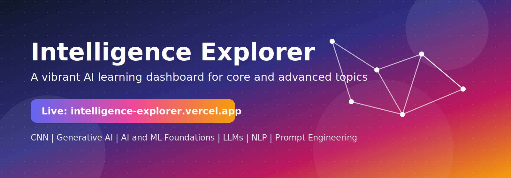

<p align="center">
  
</p>

<h1 align="center"> Intelligence Explorer</h1>

<p align="center">
  
  
  
  <a href="https://intelligence-explorer.vercel.app/">
    </a>
</p>

---

## 📖 About

Intelligence Explorer is an interactive AI learning dashboard that organizes foundational and advanced topics in one clean interface. The project uses a colorful card-based layout, smooth motion, and a Three.js animated background to make technical learning more engaging.

---

## 📚 Learning Modules

| Icon | Topic | Page |
| --- | --- | --- |
|  | CNN and Deep Learning | `pages/cnn.html` |
|  | Generative AI | `pages/genai.html` |
|  | AI and ML Foundations | `pages/intro.html` |
|  | Large Language Models | `pages/llm.html` |
|  | Natural Language Processing | `pages/nlp.html` |
|  | Prompt Engineering | `pages/prompt.html` |

---

## 📂 Project Structure

- `dashboard.html`: Main dashboard page
- `styles/dashboard.css`: Dashboard styles and animations
- `pages/`: Module-specific pages
- `assets/`: Favicon and README visual assets
- `pdf_analysis/`: Text extracted from course PDFs
- `extract_pdfs.js`: PDF text extraction utility

---

## 💻 Local Development

### 📋 Prerequisites

- A modern web browser (Chrome, Firefox, Safari, Edge)
- A code editor (VS Code, Sublime Text, etc.)
- Node.js (optional, for a local web server)

### ⚙️ Installation

Clone the repository:

```bash
git clone https://github.com/ajaygangwar945/Intelligence-Explorer.git
```

Navigate to the project directory:

```bash
cd Intelligence-Explorer
```

### 🚀 Open in browser

- Simply open `dashboard.html` in your web browser
- Or use a local server like Live Server (VS Code extension) or run `npx serve .`

---

## 🌐 Live Demo

This project is deployed on Vercel for fast hosting with continuous deployment.

<a href="https://intelligence-explorer.vercel.app/">
    </a>

---

## ⭐️ Show your support

If you find this project useful or interesting, please consider giving it a star ⭐️! It helps others find it and motivates further development.
